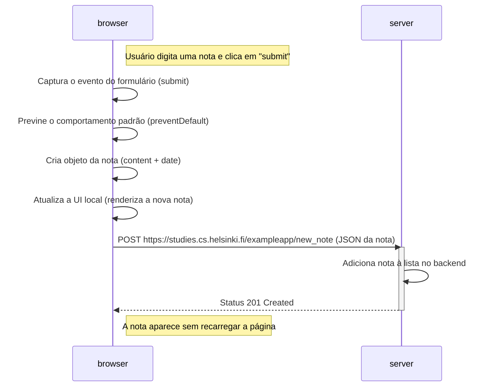

```mermaid
sequenceDiagram
    participant browser
    participant server

    Note right of browser: Usuário digita uma nota e clica em "submit"

    browser->>browser: Captura o evento do formulário (submit)
    browser->>browser: Previne o comportamento padrão (preventDefault)
    browser->>browser: Cria objeto da nota (content + date)
    browser->>browser: Atualiza a UI local (renderiza a nova nota)

    browser->>server: POST https://studies.cs.helsinki.fi/exampleapp/new_note (JSON da nota)
    activate server
    server->>server: Adiciona nota à lista no backend
    server-->>browser: Status 201 Created
    deactivate server

    Note right of browser: A nota aparece sem recarregar a página
```